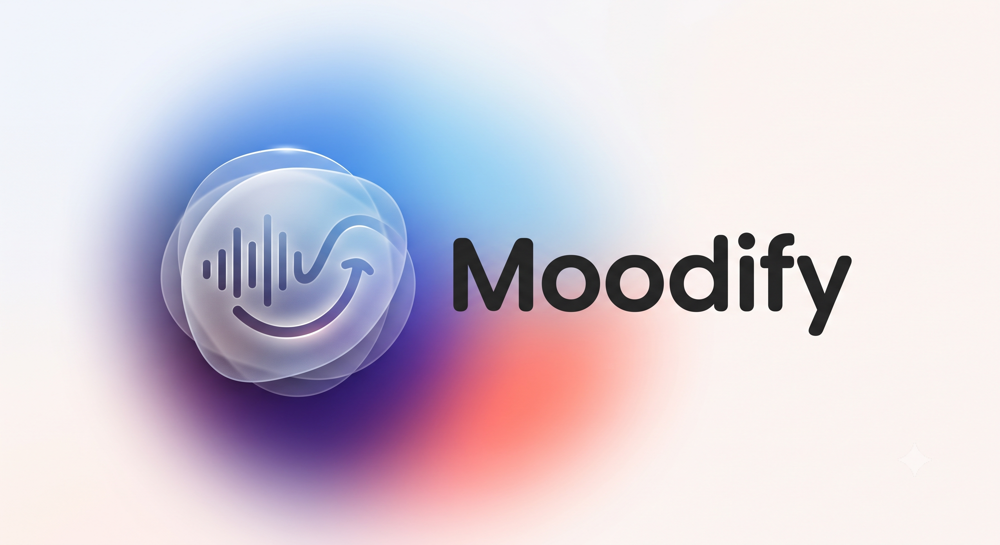
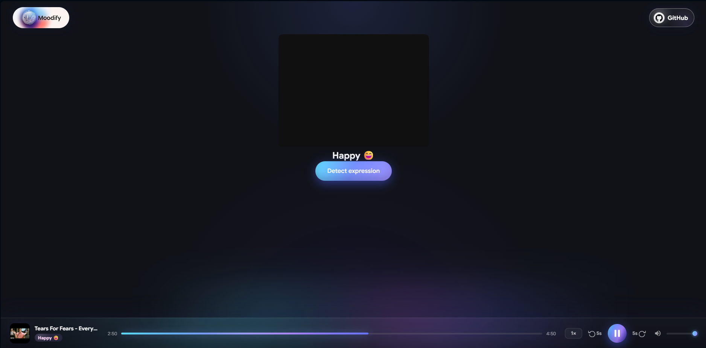
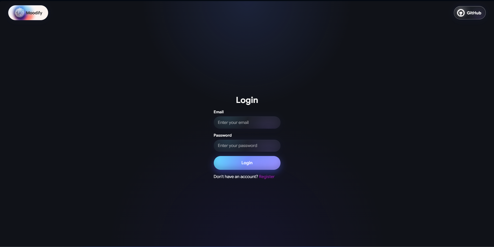
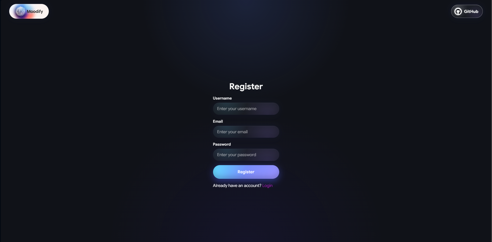

# Moodify



Moodify is a full-stack MERN music experience that turns real-time facial expression detection into personalized music playback. The app uses the browser's webcam with MediaPipe face landmarking to identify the user's current mood, then fetches and plays a song that matches that expression. It combines a React + Vite frontend, a custom glassmorphism UI, cookie-based JWT authentication, MongoDB persistence, Redis-backed token blacklisting, and an Express API for mood-matched songs. Moodify also includes a custom audio player with playback controls, speed selection, seeking, volume control, and dynamic song metadata.

## Screenshots


### Home



### Login



### Register



## Features

- Facial expression detection using MediaPipe Tasks Vision.
- Mood-based music fetching for happy, sad, and surprised expressions.
- Custom audio player with play/pause, seek, skip, playback speed, mute, and volume controls.
- JWT authentication stored in HTTP cookies.
- Protected home route with auth hydration through `/api/auth/get-me`.
- Logout flow with Redis token blacklisting.
- Song upload API that reads MP3 ID3 metadata and uploads audio/poster assets to ImageKit.
- Dark glassmorphism UI with custom Google Sans fonts, aurora-style buttons, glass inputs, and a shared navbar.

## Tech Stack

### Frontend

- React 19
- Vite
- React Router
- Axios
- Sass
- MediaPipe Tasks Vision

### Backend

- Node.js
- Express 5
- MongoDB + Mongoose
- Redis + ioredis
- JWT
- bcryptjs
- Multer
- ImageKit
- node-id3

## Project Structure

```text
moodify/
|-- Backend/
|   |-- server.js
|   `-- src/
|       |-- app.js
|       |-- config/
|       |-- controllers/
|       |-- middlewares/
|       |-- models/
|       |-- routes/
|       `-- services/
|-- Frontend/
|   |-- src/
|   |   |-- assets/
|   |   |   `-- screenshots/
|   |   |-- features/
|   |   |   |-- auth/
|   |   |   |-- Expression/
|   |   |   |-- home/
|   |   |   `-- shared/
|   |   |-- App.jsx
|   |   |-- app.routes.jsx
|   |   `-- main.jsx
|   `-- package.json
|-- .gitignore
`-- README.md
```

## How It Works

1. A user registers or logs in through the React auth pages.
2. The backend validates credentials, creates a JWT, and stores it in a cookie.
3. Protected routes hydrate the current user by calling `/api/auth/get-me`.
4. On the home page, MediaPipe opens the webcam and analyzes face blendshapes.
5. The detected expression is mapped to a mood such as happy, sad, or surprised.
6. The frontend requests a song from `/api/songs?mood=<mood>`.
7. The custom player receives the returned song and handles playback controls.

## API Overview

### Auth Routes

| Method | Endpoint | Description |
| --- | --- | --- |
| `POST` | `/api/auth/register` | Creates a new user and sets an auth cookie. |
| `POST` | `/api/auth/login` | Logs in an existing user and sets an auth cookie. |
| `GET` | `/api/auth/get-me` | Returns the authenticated user's profile. |
| `GET` | `/api/auth/logout` | Clears the cookie and blacklists the token in Redis. |

### Song Routes

| Method | Endpoint | Description |
| --- | --- | --- |
| `POST` | `/api/songs` | Uploads an MP3 file, extracts metadata, uploads assets to ImageKit, and stores the song. |
| `GET` | `/api/songs?mood=<mood>` | Fetches a song matching the detected mood. |

## Environment Variables

Create a `.env` file inside `Backend/`.

```env
MONGO_URI=your_mongodb_connection_string
JWT_SECRET=your_jwt_secret

REDIS_HOST=your_redis_host
REDIS_PORT=your_redis_port
REDIS_PASSWORD=your_redis_password

IMAGEKIT_PRIVATE_KEY=your_imagekit_private_key
```

## Getting Started

### 1. Clone the repository

```bash
git clone https://github.com/MELLOxProg/moodify.git
cd moodify
```

### 2. Install backend dependencies

```bash
cd Backend
npm install
```

### 3. Install frontend dependencies

```bash
cd ../Frontend
npm install
```

### 4. Start the backend

```bash
cd ../Backend
npm run dev
```

The backend runs on:

```text
http://localhost:3000
```

### 5. Start the frontend

```bash
cd ../Frontend
npm run dev
```

The frontend runs on:

```text
http://localhost:5173
```

## Notes

- The frontend Axios clients are currently configured to call `http://localhost:3000`.
- The backend CORS configuration allows `http://localhost:5173` with credentials enabled.
- Uploaded songs are limited to 10 MB through Multer memory storage.
- `Frontend/dist/` is generated by production builds and is intentionally ignored by Git.

## Future Improvements

- Add a dashboard/admin flow for uploading and managing mood-based songs.
- Improve mood classification thresholds and add more emotion categories.
- Add loading and error states around face detection and song fetching.
- Add automated tests for auth, protected routes, and song retrieval.
- Move API base URLs into environment variables for easier deployment.

## License

This project is currently unlicensed. Add a license before using it in production or accepting external contributions.
